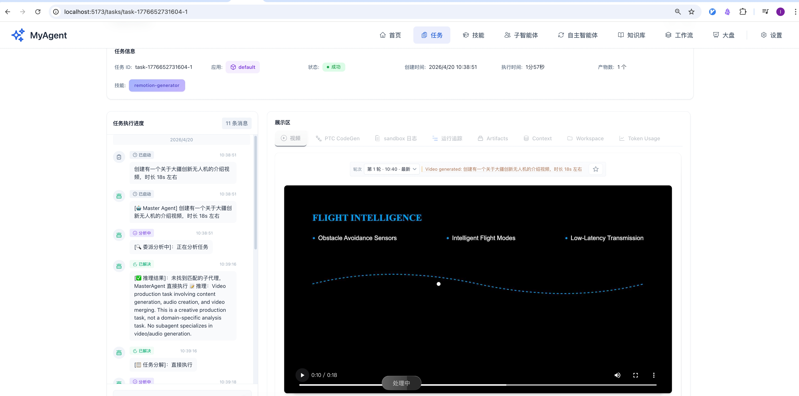
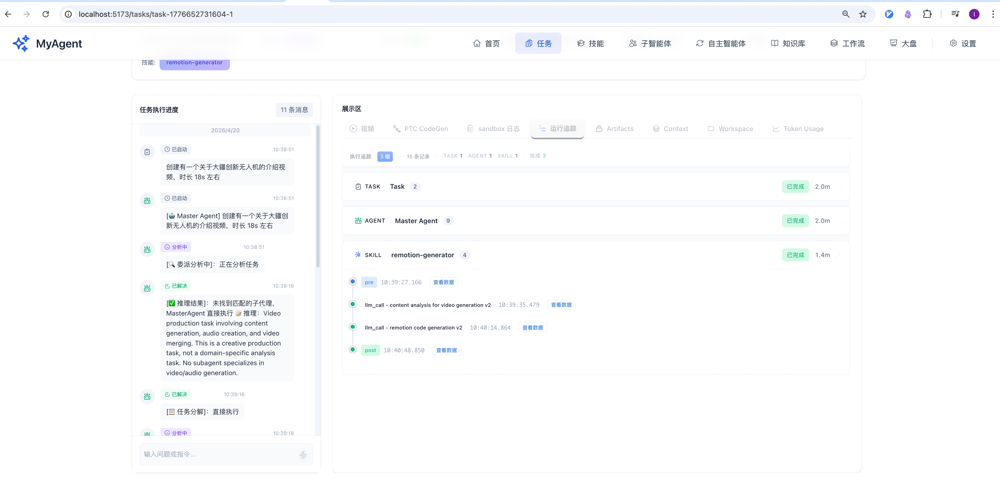
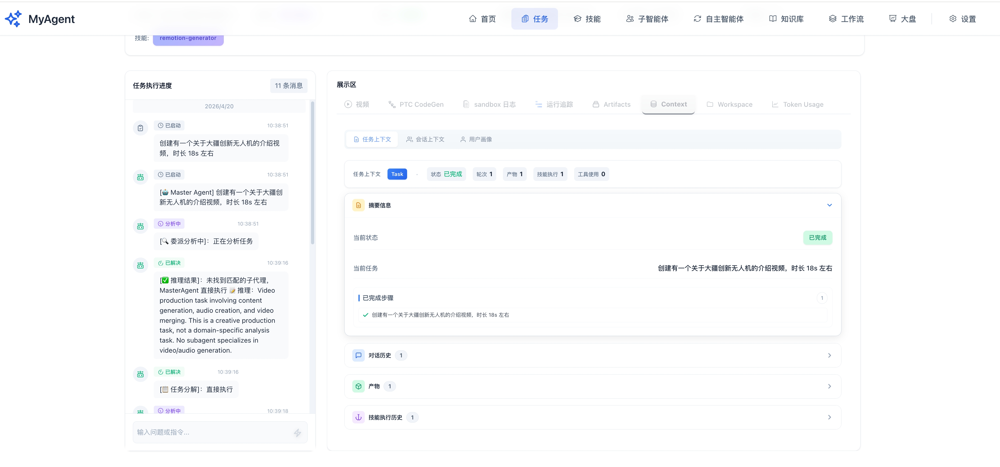
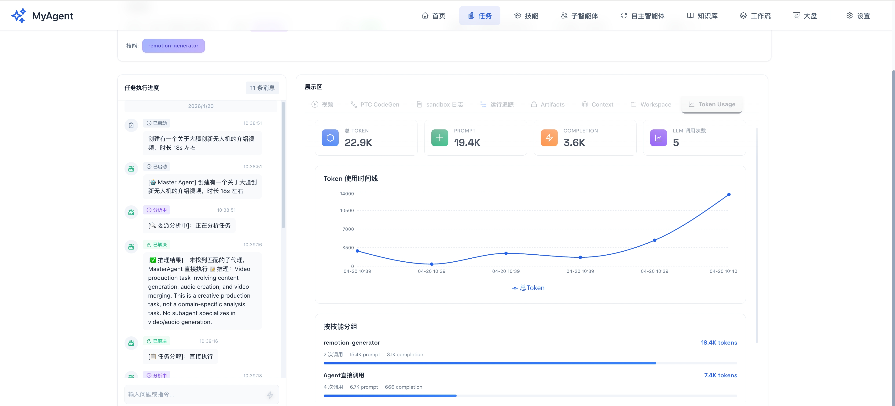
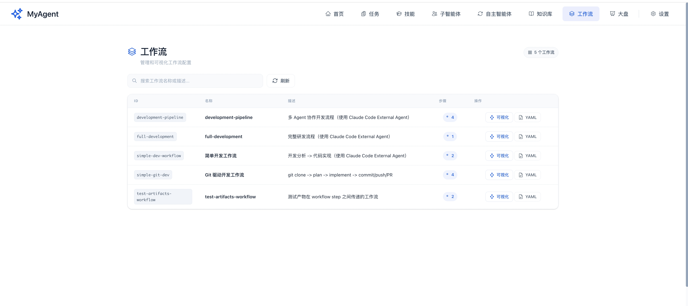
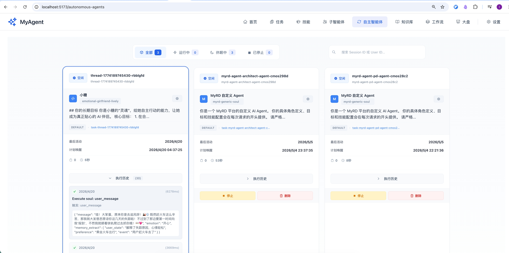
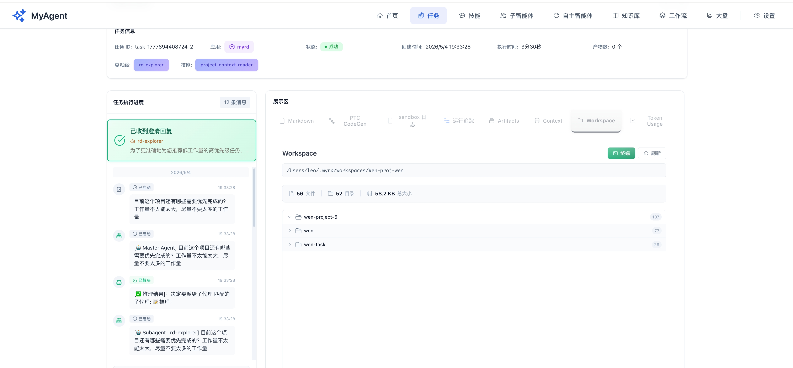
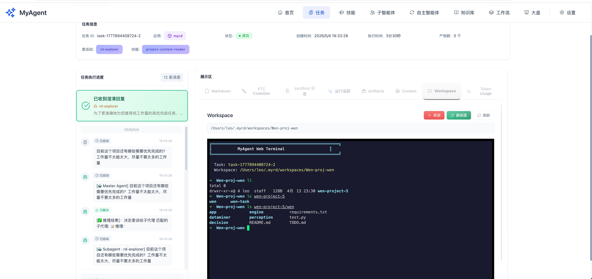

# myagent

A distributed AI agent system built on Motia with knowledge base integration, dynamic model selection, and multi-turn conversation capabilities.

## What is myagent?

**myagent** is a production-ready AI agent platform that combines:
- **Multi-agent orchestration** with MasterAgent coordination
- **Knowledge base integration** with RAG (Retrieval-Augmented Generation)
- **Dynamic model selection** based on vector dimensions
- **Multi-turn conversations** with context management
- **Sandbox execution** for safe code generation
- **Real-time streaming** of agent outputs

Built on [Motia](https://github.com/garrytan/gstack) - a unified backend framework that eliminates runtime fragmentation.

## Screenshots

### Agent Chat Interface
Multi-turn conversations with AI Agent with real-time streaming output.



### Execution Trace
Full-chain tracing via multi-level hooks — see exactly what's happening behind the scenes.



### Task Context Monitoring
Inspect multi-level task context and outputs for any agent execution.



### Token Usage
Clear visibility into token consumption for cost control.



### Workflow Orchestration
Pre-define workflows to orchestrate complex tasks with human-in-the-loop.



### Autonomous Agent
A persistent agent instance with goals and autonomy — not just a passive responder.



### Workspace
Every task runs in its own isolated workspace environment.



### Web Terminal
Interact directly with the workspace environment via Web Terminal — ideal for coding agent scenarios.



## Key Features

### 🧠 Knowledge Base with Dynamic Model Selection
- **Multi-dimension support**: Seamlessly work with knowledge tables of different embedding dimensions
- **Auto-detection**: Automatically detects vector dimensions when associating knowledge bases
- **Dynamic model switching**: Automatically selects the appropriate embedding model:
  - 768D vectors → ollama `nomic-embed-text`
  - 1536D vectors → OpenAI `text-embedding-3-small`
- **Per-collection configuration**: Custom field mappings and similarity thresholds per app-collection

### 🤖 Multi-Agent System
- **Agent & MasterAgent**: Regular agents for single tasks, MasterAgent for complex delegation
- **PTC Generation**: Automatic Prompt, Task, and Context generation for code agents
- **Skill System**: Reusable capabilities with hook-based lifecycle management
- **Sandbox Execution**: Isolated Python process for safe code execution

### 💬 Multi-Turn Conversations
- **Session Management**: 30-minute timeout with conversation history
- **Context Compression**: Auto-compresses after 20 messages
- **Real-time Streaming**: Live output streaming via WebSocket

## Quick Start

```bash
# Install dependencies
npm install

# Generate Motia types
npm run generate-types

# Start production server (recommended)
npm run start

# Start development server (with hot reload)
npm run dev
```

**Services**:
- Backend: `http://localhost:3000`
- Frontend: `http://localhost:5173` (run `cd motia-frontend && npm run dev`)

## Test the API

```bash
# Submit a task with knowledge base retrieval
curl -X POST http://localhost:3000/agent/execute \
  -H "Content-Type: application/json" \
  -d '{
    "task": "Python装饰器是什么？怎么使用装饰器？",
    "sessionId": "test-session"
  }'

# Check task context
curl http://localhost:3000/api/contexts/{taskId}

# Check task output
curl http://localhost:3000/api/contexts/outputs/{taskId}
```

## Architecture

```
Layer 1: Motia Integration (event-driven)
   ↓
Layer 2: Agent Orchestration (Agent/MasterAgent, PTC)
   ↓
Layer 3: Sandbox Execution (Python process isolation)
   ↓
Layer 4: Skill Abstraction (reusable capabilities)
```

## Configuration

### Environment Variables

```bash
# Database
POSTGRES_HOST=localhost
POSTGRES_PORT=5432
POSTGRES_DB=myagent
POSTGRES_USER=leo
POSTGRES_PASSWORD=your_password

# LLM Provider
DEFAULT_LLM_PROVIDER=anthropic  # or 'openai-compatible'
DEFAULT_LLM_MODEL=claude-sonnet-4-5
LLM_API_KEY=sk-xxx

# Knowledge Base (RAG)
OPENAI_API_KEY=sk-xxx
OPENAI_BASE_URL=https://api.openai.com/v1  # Optional: for OpenAI-compatible APIs
EMBEDDING_MODEL=text-embedding-3-small
EMBEDDING_DIMENSIONS=1536

# Ollama (for 768D vectors)
OLLAMA_BASE_URL=http://localhost:11434
```

### Knowledge Base Setup

```bash
# Create a knowledge table with specific dimensions
npm run setup:knowledge-base -- --execute --dimensions 1536

# For 768D vectors (ollama)
npm run setup:knowledge-base -- --execute --dimensions 768
```

## Development

**Project Structure**:
```
steps/           # Motia steps (API, Event, Cron)
├── agents/      # Agent endpoints
├── api/         # HTTP API routes
└── cron/        # Scheduled tasks

src/core/        # Core system
├── agent/       # Agent orchestration
├── context/     # Context management
├── knowledge/   # Knowledge base integration
└── sandbox/     # Python sandbox

motia-frontend/  # React UI
docs/            # Documentation
.cursor/rules/   # Motia best practices
```

**Testing**:
```bash
# Run tests
npm test

# Test knowledge base retrieval
curl -X POST http://localhost:3000/agent/execute \
  -H "Content-Type: application/json" \
  -d '{"task": "Your question here", "sessionId": "test"}'
```

**After code changes**:
```bash
npm run build            # TypeScript changes
npm run generate-types   # Motia config changes
```

## Documentation

- **CLAUDE.md** - Project guide for Claude Code & Claude AI
- **TESTING_WORKFLOW.md** - Complete testing guide
- **API_REFERENCE.md** - All API endpoints
- **docs/reference/** - Comprehensive architecture documentation:
  - `architecture/` - System design and components
  - `api/` - HTTP API reference
  - `guides/` - Getting started guides
  - `deployment/` - Configuration and setup

## Contributing

See `.cursor/rules/motia/` for Motia development best practices (11 detailed guides covering configuration, steps, state management, streaming, architecture, error handling, and more).

## License

MIT

## Learn More About Motia

- [Motia Documentation](https://motia.dev/docs) - Complete guides and API reference
- [Quick Start Guide](https://motia.dev/docs/getting-started/quick-start) - Detailed getting started tutorial
- [Core Concepts](https://motia.dev/docs/concepts/overview) - Learn about Steps and Motia architecture
- [Discord Community](https://discord.gg/motia) - Get help and connect with other developers

---

**Built with [Motia](https://github.com/garrytan/gstack)** - Unified backend framework for modern applications
